# 📊 Superstore Analytics Dashboard  

### Business Intelligence + Forecasting + Customer Segmentation (RFM)


# 🎯 Project Overview

This project transforms the **Superstore retail dataset** into a complete **Business Intelligence and Advanced Analytics Dashboard**.
**Superstore Sales Analytics** is an end-to-end Python project that analyzes a large retail dataset to uncover business insights, forecast demand, and segment customers for targeted strategy.  
This project was completed as part of the **Advanced Analytics** course and delivers an interactive **Dash dashboard** that enables stakeholders to explore trends, evaluate forecast performance, and profile customer segments.

The objective was to:

- Build a dynamic decision-support dashboard  
- Forecast future sales and validate model performance  
- Evaluate forecast KPIs across business segments  
- Segment customers using RFM + clustering  
- Generate actionable business insights

---

## 🧠 Problem Statement

Retail managers often need actionable insights from their sales data to:
- Understand historical performance by product, region, and segment
- Forecast future demand with performance validation
- Identify high-value customer segments
- Inform price, inventory, and marketing decisions

This project provides a **data pipeline, analytics models, and a user-friendly dashboard** to support those needs.

---

# 📌 Data Source
 
Kaggle Link:  👉 https://www.kaggle.com/datasets/vivek468/superstore-dataset-final  

---

## 🧰 Tech Stack

| Feature | Technology |
|----------|------------|
| Data Cleaning | Pandas, NumPy |
| EDA | Jupyter Notebook |
| Forecasting | ARIMA-style + Holdout Validation |
| Prototype Forecast | Prophet |
| Customer Segmentation | RFM + KMeans |
| Visualization | Plotly |
| Dashboard | Dash |
| Environment | Python 3.12 (venv312) |
| Version Control | Git + GitHub |

---

## 🚀 Project Journey (How It Evolved)
This project evolved through structured analytical stages:

## Phase 1 — Raw Data Exploration

We began with loading and inspecting the raw dataset.

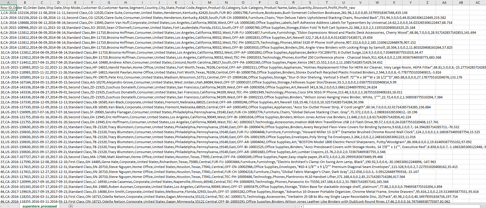

Notebook:  
`notebooks/01_data_loading_cleaning.ipynb`  👉 **[Data cleaning](notebooks/01_data_loading_cleaning.ipynb)**

Tasks performed:
- Schema inspection  
- Data type corrections  
- Missing value validation  
- Duplicate checks  
- Date parsing  

---

## Phase 2 — Data Cleaning & Processed Dataset

After cleaning and transformation:

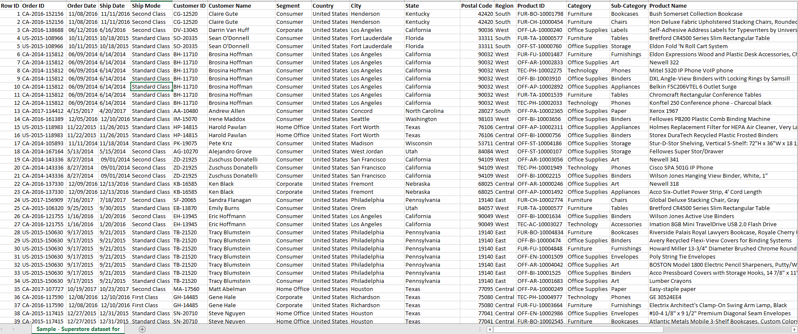

The raw dataset underwent:
- Datatype conversion (dates)
- Duplicate removal
- Missing value checks
- Profit scaling correction (final validation)
- Aggregation consistency
- Sales & Profit Totals
- Processed dataset exported as `superstore_processed.csv`  👉 **[Processed Data](data/processed)**

---

## Phase 3 — Exploratory Data Analysis (EDA)

Notebook:  
`notebooks/02_eda.ipynb`  👉 **[Exploratory data analysis](notebooks/02_eda.ipynb)**

### Monthly Sales Trend (2014–2017)

.png)

### Monthly Profit Trend (2014–2017)

.png)

### Sales vs Profit Over Time

.png)

### Discount vs Profit Relationship

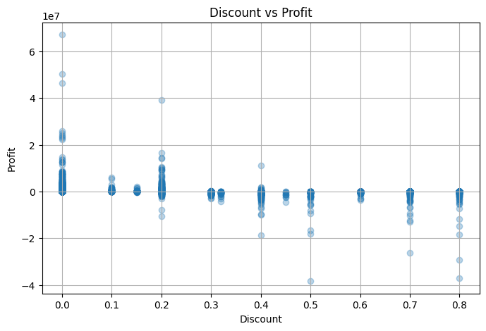

Key findings:
- Discount negatively impacts profit  
- Clear seasonal sales patterns  
- Performance differences across categories  

---

# 🧠 Customer Segmentation (RFM + Clustering)

Notebook:  
`notebooks/03_rfm_analysis.ipynb`  👉 **[RFM + Clustering](notebooks/03_rfm_analysis.ipynb)**

RFM Metrics:
- **Recency** – Days since last purchase  
- **Frequency** – Number of orders  
- **Monetary** – Total purchase value  

### RFM Visualizations

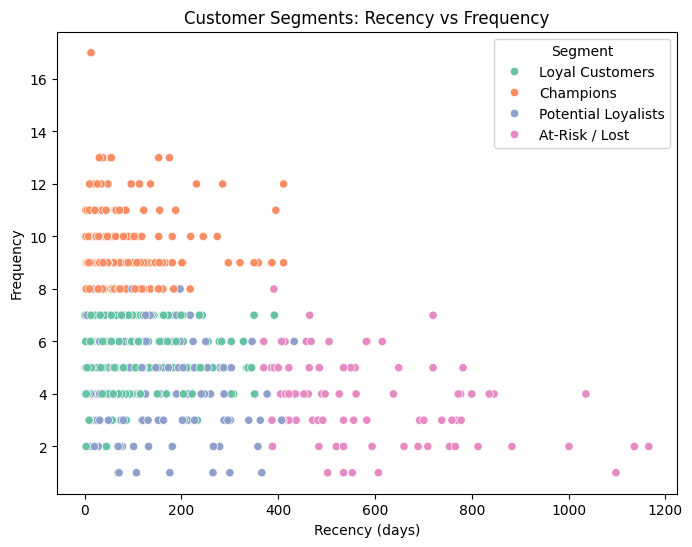
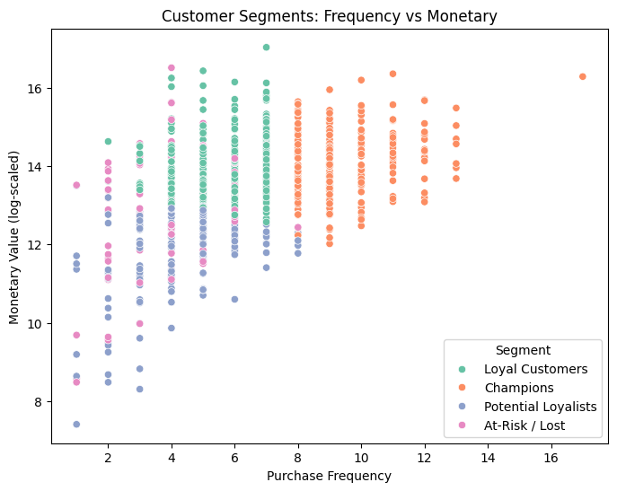
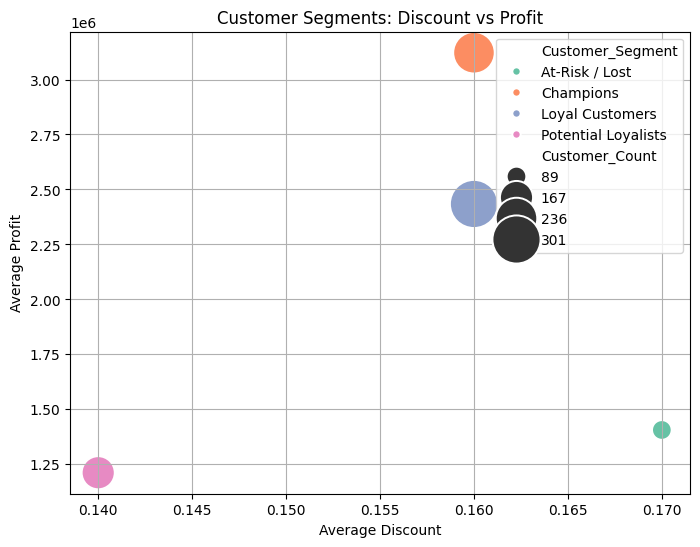

### Optimal K Determination

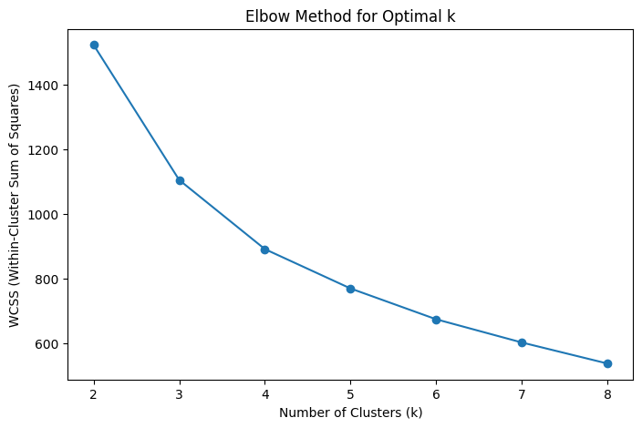

Final model: **KMeans (k = 4)**

Segments identified:
- Champions  
- Loyal Customers  
- Big Spenders  
- Lost / At Risk  

---

# 📈 Forecasting & Validation

Notebook:  
`notebooks/04_forecasting.ipynb`  👉 **[Forecasting](notebooks/04_forecasting.ipynb)**

Methods explored:
- ARIMA-style modeling  
- Prophet prototype  

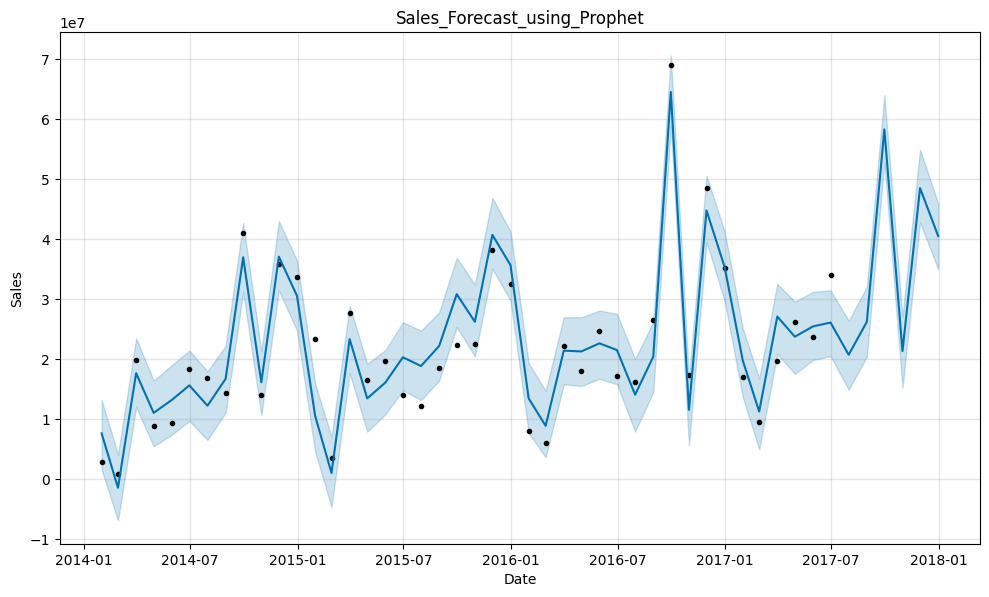

Final dashboard implementation includes:
- 6-month forecast  
- 12-month holdout validation  
- RMSE & MAPE metrics  

### Sales Forecast with MAPE

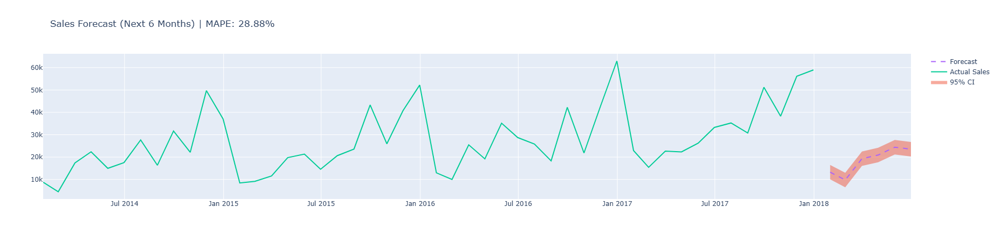

### MAPE Metric

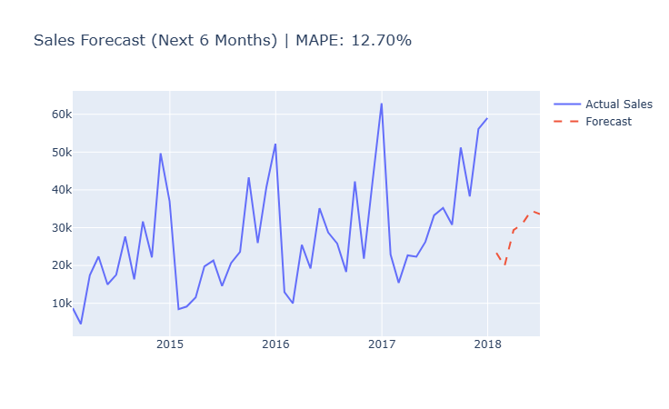

---

# 🖥️ Dashboard Evolution

Initially developed:
- `streamlit_app.py`  👉 **[Streamlit](app/streamlit_app.py)**
- `test_app.py`       👉 **[Streamlit Test](app/test_app.py)**

Due to frontend layout and rendering constraints, migrated to **Dash**.

Final architecture:
- `rebuild_processed.py`  👉 **[Rebuilding](app/rebuild_processed.py)**
- `forecasting.py`        👉 **[Forecasting](app/forecasting.py)**
- `rfm_model.py`          👉 **[RFM Model](app/rfm_model.py)**
- `dash_app.py`           👉 **[Dash Dashboard](app/dash_app.py)**

---

# 📊 Final Dashboard Preview

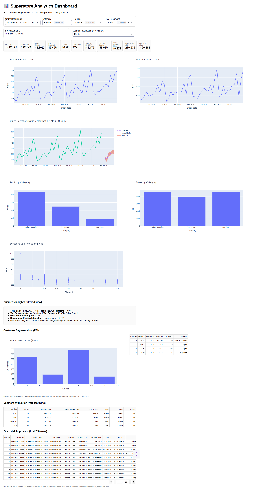

---

### **Key Business KPIs**

Displays:
- Total Sales
- Total Profit
- Profit Margin
- Orders
- Customers
- Forecast (Next 6 Months)
- Forecast Growth %
- RMSE (Holdout 12M)
- Actual vs Forecast delta
  
---

### **Time Series Trend Analysis Dashboard**

View:
- Monthly Sales Trend
- Monthly Profit Trend
  
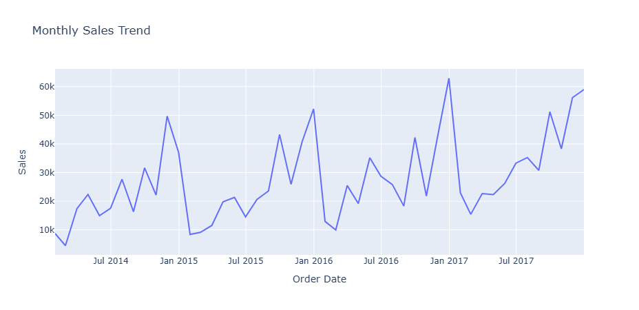
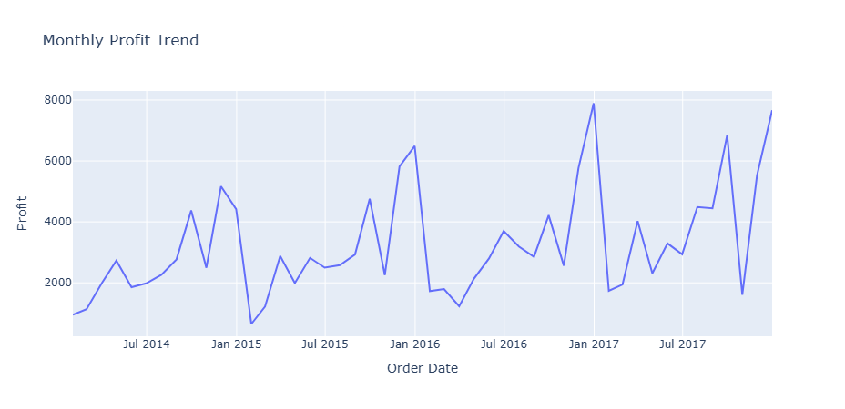

---

## Category Performance

View:
- Sales by Category
- Profit by Category

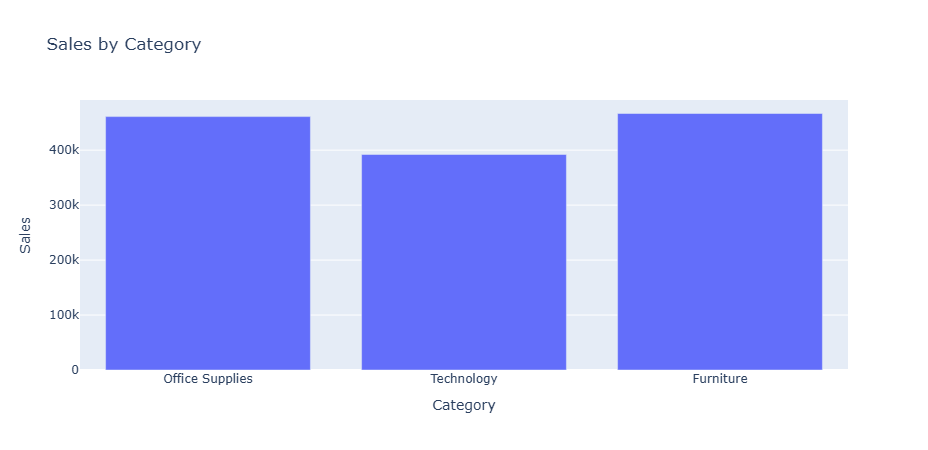
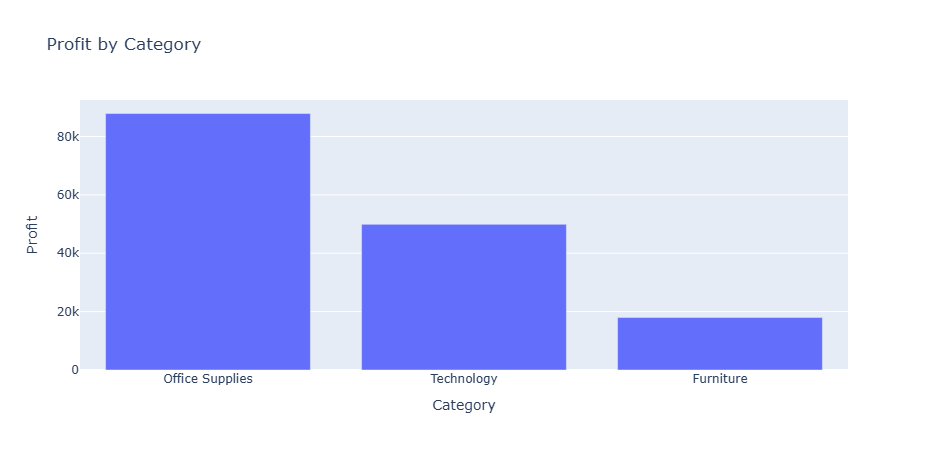

---

## Discount Analysis (Dashboard)

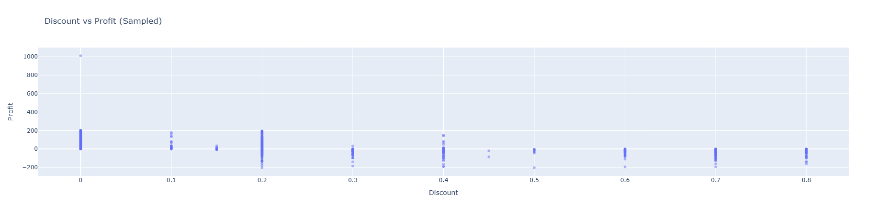

---

## Segment Evaluation (Forecast KPIs)

Evaluates forecast performance by:
- Category  
- Region  
- Retail Segment  

Outputs include:
- forecast_sum  
- last6_actual_sum  
- growth_pct  
- mape  
- rmse  

---

## Customer Segmentation Dashboard

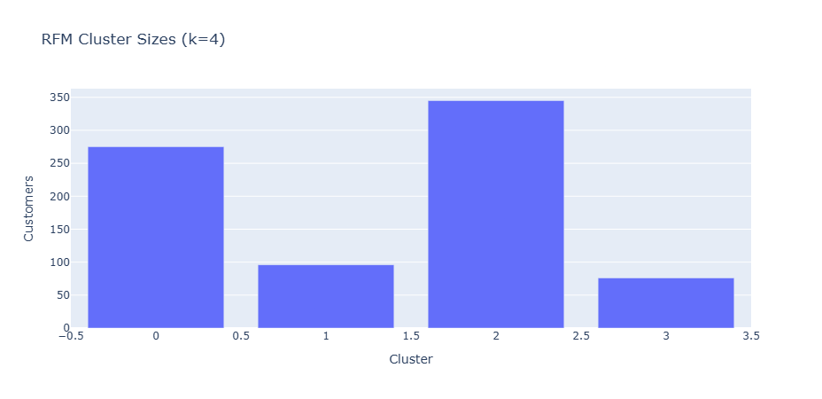

Displays:
- Cluster size distribution  
- RFM profiling table  
- Segment labeling  

---

## Segment-Specific Forecast Examples

View:
- Champion Forecast
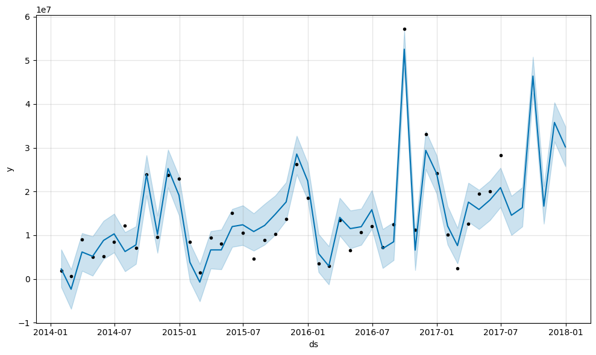

View:
- Loyal Forecast
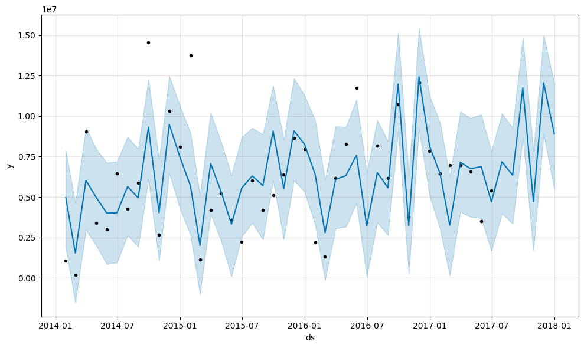

---

## 💡 Business Insights (Auto-Generated)

The dashboard calculates insights based on filtered data:
- Top performing categories & regions
- Profit-discount relationships
- Customer segment behavior

📌 **Business insights block**:
<!-- asset: business_insights.png -->


---

## 📝 How to Run

1. Clone the repo:
```bash
git clone https://github.com/nomanmridha/Superstore-data-Analysis.git
cd Superstore-data-Analysis
```

2. Create a Python 3.12 virtual environment:
```bash
python -m venv venv312
.\venv312\Scripts\activate     # Windows
source venv312/bin/activate   # Mac/Linux
```

3. Install requirements:
```bash
pip install -r requirements.txt
```

4. Run the dashboard:
```bash
python app/dash_app.py
```

Visit:
```text
http://127.0.0.1:8050
```

---

## 📊 Sample Screenshots

Showcase of key outputs:

| Feature | Preview |
|--------|---------|
| Forecast Chart |  |
| Segment Eval (Region) |  |
| RFM Cluster |  |

---

## 📌 Limitations & Future Work

- Forecast model uses seasonal-naive method — future work could integrate SARIMA/Prophet
- RFM uses fixed k=4 — more dynamic cluster validation possible
- Additional filters (product, store) could enhance analysis

---


## 📁 Repository Structure

```
Superstore-data-Analysis/
├── app/
│   ├── dash_app.py
│   ├── forecasting.py
│   ├── rfm_model.py
│   ├── rebuild_processed.py
├── data/
│   ├── raw/
│   │   └── superstore_clean.csv
│   └── processed/
│       └── superstore_processed.csv
├── notebooks/
│   ├── 01_data_loading_cleaning.ipynb
│   ├── 02_eda.ipynb
│   ├── 03_rfm_analysis.ipynb
│   └── 04_forecasting.ipynb
├── assets/
│   └── dashboard_screenshots/
├── slides/
├── reports/
├── README.md
└── requirements.txt
```

## 👤 Author
**Course:** Advance Analytics (WiSe26)  
**University:** Fachhochschule Südwestfalen  
**Supervisor:** Prof. Dr. Christian Leubner  
**Project Type:** Individual Research Project


## 🤝 Connect & Contact

[](https://www.linkedin.com/in/md-abdullah-al-noman-333aa4155/)
[](https://github.com/nomanmridha/)
[](mailto:noman.hr.18@gmail.com)
* **University:** FH Südwestfalen – Advanced Analytics

---

📌 *This repository demonstrates how academic projects can be elevated to industry-ready analytics portfolios through strong documentation, business framing, and technical rigor.*

